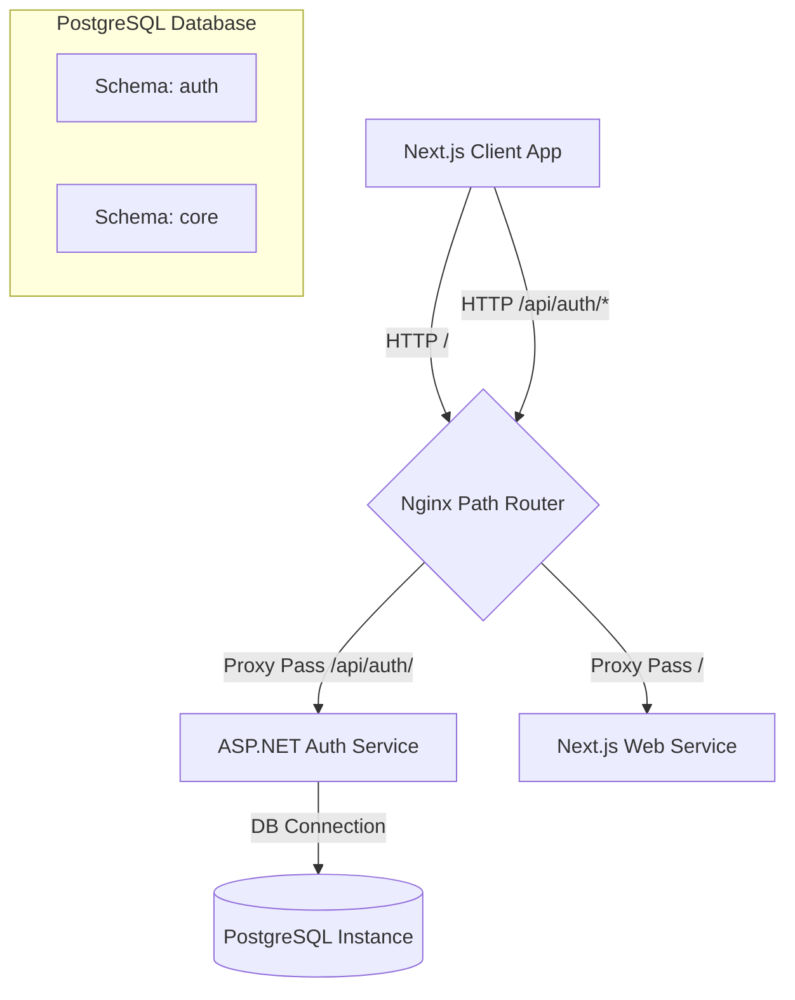
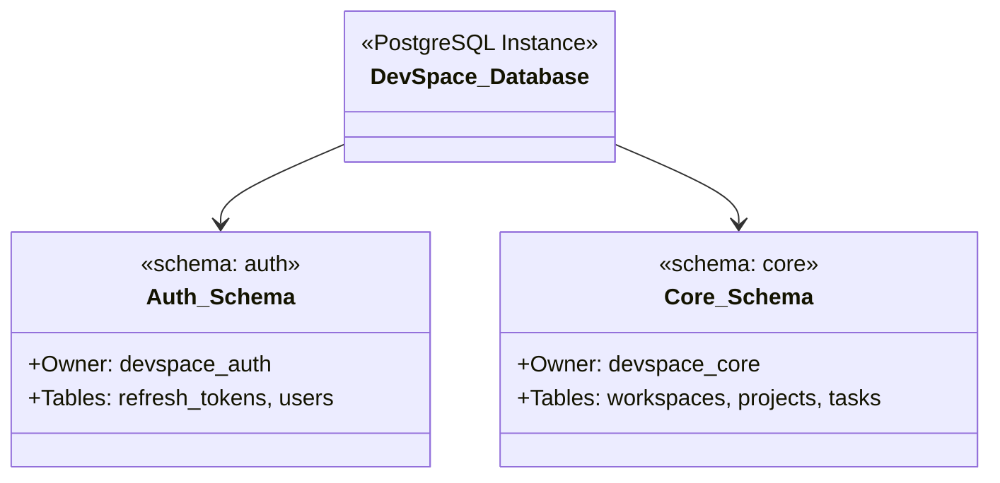
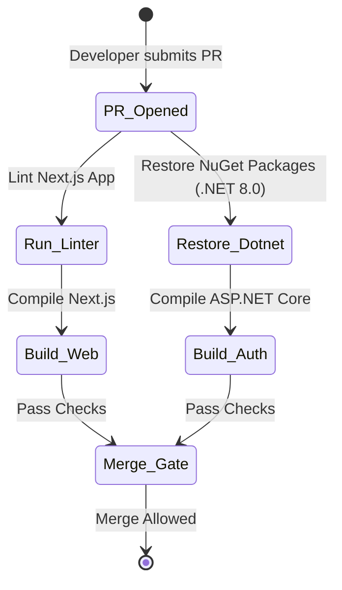

# DevSpace Architecture & Design Document (Bootstrap Spec)

This document provides a detailed overview of the system architecture, data flows, and design decisions for the bootstrap stage of the **DevSpace** workspace.

---

## 1. System Architecture (Phase 1 Routing)

At this stage, routing is handled entirely by Nginx on the host port `80`. An API gateway is not yet introduced (following the **Evidence First** tenet).

### Routing Table (Nginx)

| Path Pattern | Upstream Destination | Protocol | Purpose |
| :--- | :--- | :--- | :--- |
| `/api/auth/` | `auth-service:8080` | HTTP | Authentication & user operations |
| `/` | `web:3000` | HTTP | Frontend user interface |

---

## 2. Database Ownership Design

We enforce strict domain limits using PostgreSQL schemas instead of deploying separate server instances.

### Design Constraints
1. **Schema Separation**: 
   - `auth` schema: Exclusively owned by `devspace_auth` database user.
   - `core` schema: Exclusively owned by `devspace_core` database user.
2. **Access Security**:
   - `auth-service` connects using `devspace_auth` and has no access to the `core` schema tables.
   - `core-service` connects using `devspace_core` and has no access to the `auth` schema tables.
   - Inter-service database sharing is forbidden. Communication between services must be conducted via HTTP APIs or async message events (e.g. RabbitMQ in Phase 6).

---

## 3. Auth Service Spec (Phase 1)

### Baseline Endpoints (Auth Service)

| HTTP Method | Endpoint | Access | Description |
| :--- | :--- | :--- | :--- |
| `GET` | `/health` | Public | Returns system status (used by Docker health check) |
| `POST` | `/register` | Public | Register new user |
| `POST` | `/login` | Public | Authenticate user and issue tokens |
| `POST` | `/refresh` | Public | Rotate expired Access Token using Refresh Token |
| `POST` | `/logout` | Authenticated | Revoke refresh tokens |

### Token Strategy
- **Access Tokens**: Short-lived JWTs (e.g., 15 mins) signed using an asymmetric key pair (**RS256**). The Auth Service holds the private key; other services verify signatures using the public key fetched from the JWKS endpoint.
- **Refresh Tokens**: Long-lived random strings stored in the database (`auth.refresh_tokens`) with explicit expiration times.

---

## 4. CI/CD & Verification Pipelines

The project relies on GitHub Actions to ensure build integrity before pull requests can be merged into `main`.

